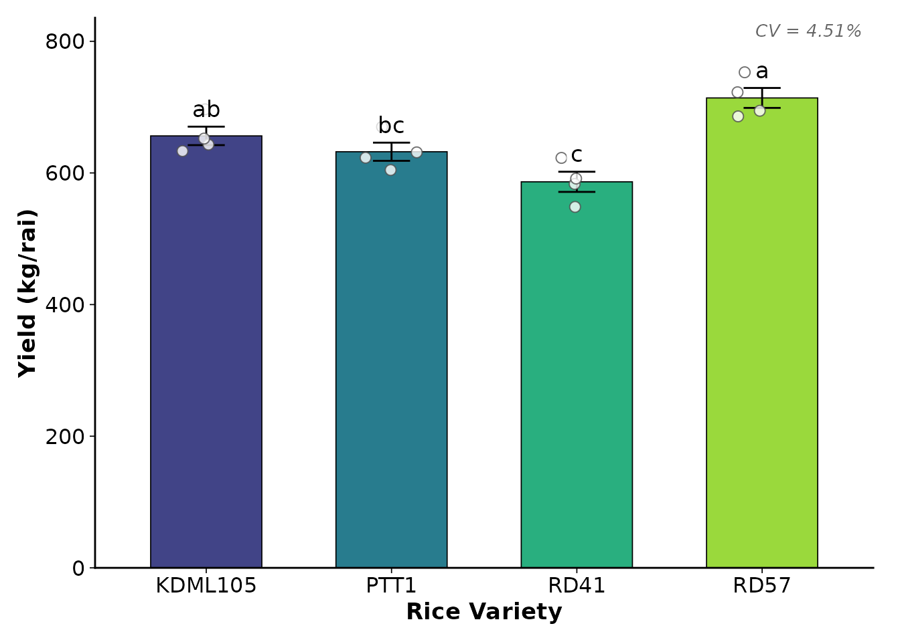

# เริ่มต้นใช้งาน khaosuay: การวิเคราะห์ข้อมูลเกษตรง่ายเหมือนหุงข้าว

## ภาพรวมของแพ็กเกจ (Package Overview)

**khaosuay** ("ข้าวสวย") นำเสนอแนวคิดการวิเคราะห์ข้อมูลทางเกษตรให้ง่ายเหมือนกับการ
“หุงข้าว” โดยแบ่งการทำงานออกเป็น 4 ขั้นตอนหลัก:

| ขั้นตอน | ฟังก์ชัน                                                                                                                                                                                                                                | คำอุปมา | หน้าที่                                         |
|-------|--------------------------------------------------------------------------------------------------------------------------------------------------------------------------------------------------------------------------------------|--------|----------------------------------------------|
| 1     | [`wash_rice()`](https://kanthjs.github.io/KhaoSuay/reference/wash_rice.md)                                                                                                                                                           | ซาวข้าว | ทำความสะอาดข้อมูล ตรวจ outlier แนะนำสิ่งที่ต้องแก้ไข |
| 2     | [`taste_rice()`](https://kanthjs.github.io/KhaoSuay/reference/taste_rice.md)                                                                                                                                                         | ชิมข้าว  | ตรวจ Assumptions (Normality, Equal Variance) |
| 3     | [`cook_crd()`](https://kanthjs.github.io/KhaoSuay/reference/cook_crd.md) / [`cook_rcbd()`](https://kanthjs.github.io/KhaoSuay/reference/cook_rcbd.md) / [`cook_split()`](https://kanthjs.github.io/KhaoSuay/reference/cook_split.md) | หุงข้าว  | วิเคราะห์สถิติตามแผนการทดลอง                     |
| 4     | [`plot_cooked()`](https://kanthjs.github.io/KhaoSuay/reference/plot_cooked.md)                                                                                                                                                       | จัดจาน  | สร้างกราฟพร้อมตีพิมพ์ (publication-ready)         |

Workflow ของ khaosuay ออกแบบให้
**ฟังก์ชันแต่ละตัวส่งต่อผลลัพธ์ไปยังขั้นตอนถัดไปได้อัตโนมัติ** เช่น
[`wash_rice()`](https://kanthjs.github.io/KhaoSuay/reference/wash_rice.md)
ส่งต่อไปยัง
[`taste_rice()`](https://kanthjs.github.io/KhaoSuay/reference/taste_rice.md)
แล้วส่งต่อไปยัง `cook_*()` จากนั้นก็
[`plot_cooked()`](https://kanthjs.github.io/KhaoSuay/reference/plot_cooked.md)
ได้อย่างราบรื่น

    wash_rice() --> taste_rice() --> cook_crd() / cook_rcbd() / cook_split() --> plot_cooked()
      (ซาวข้าว)      (ชิมข้าว)              (หุงข้าว)                           (จัดจาน)

------------------------------------------------------------------------

## ติดตั้งแพ็กเกจ (Installation)

``` r
# จาก GitHub
# install.packages("devtools")
devtools::install_github("kanthjs/KhaoSuay")
```

``` r
library(khaosuay)
#> khaosuay: สำหรับกราฟภาษาไทย เรียก setup_thai_font() ก่อนใช้ serve_plate()
```

------------------------------------------------------------------------

## ตัวอย่างแบบเต็ม: วิเคราะห์ CRD (Quick Start)

สมมติเรามีข้อมูลผลผลิตข้าว 4 สายพันธุ์ ทดลองแบบ CRD 4 ซ้ำ:

``` r
# สร้างข้อมูลตัวอย่าง
set.seed(123)
rice_data <- data.frame(
  variety = rep(c("KDML105", "RD41", "RD57", "PTT1"), each = 4),
  rep     = rep(1:4, times = 4),
  yield   = c(
    rnorm(4, mean = 650, sd = 30),
    rnorm(4, mean = 580, sd = 25),
    rnorm(4, mean = 710, sd = 35),
    rnorm(4, mean = 620, sd = 28)
  )
)
head(rice_data)
#>   variety rep    yield
#> 1 KDML105   1 633.1857
#> 2 KDML105   2 643.0947
#> 3 KDML105   3 696.7612
#> 4 KDML105   4 652.1153
#> 5    RD41   1 583.2322
#> 6    RD41   2 622.8766
```

### ขั้นตอนที่ 1: `wash_rice()` — ซาวข้าว ทำความสะอาดข้อมูล

``` r
washed <- wash_rice(
  data          = rice_data,
  treatment_col = "variety",
  rep_col       = "rep",
  design_check  = TRUE
)
#> [MAP]   คอลัมน์กรรมวิธี: 'variety' (ไม่เปลี่ยนชื่อ)
#> [MAP]   คอลัมน์ซ้ำ: 'rep' (ไม่เปลี่ยนชื่อ)
#> [INFO]  แปลงเป็น Factor: rep
#> Warning in wash_rice(data = rice_data, treatment_col = "variety", rep_col = "rep", : [WARN] ไม่สามารถเช็คแผนการทดลองได้ — ไม่พบคอลัมน์: treatment
#>   ลองระบุผ่าน treatment_col / rep_col
#>   หรือเพิ่มใน custom_aliases
#> 
#> --------------------------------------------------
#> wash_rice v3.1 — สรุปผลการล้างข้าว
#> --------------------------------------------------
#>   • แถว:        16 -> 16
#>   • คอลัมน์:    3
#>   • Factor:     rep
#>   • Numeric:    yield
#> --------------------------------------------------
#> ล้างข้าวเสร็จเรียบร้อย! ข้อมูลพร้อมหุงแล้ว
#> --------------------------------------------------
```

ดูผลการซาวข้าว:

``` r
print(washed)
#> ── washed_rice v3.1 ──
#>   Rows: 16 | Cols: 3 
#> 
#>   $data       → clean data.frame
#>   $report     → cleaning details
#>   $flagged    → problematic rows
#>   $column_map → name mapping
```

ข้อมูลที่สะอาดแล้วอยู่ใน `washed$data` และสามารถดูรายละเอียดเพิ่มเติมได้ที่
`washed$report` (สรุปผลทุกขั้นตอน) และ `washed$flagged` (แถวที่ถูก flag)

### ขั้นตอนที่ 2: `taste_rice()` — ชิมข้าว เช็คข้อมูลก่อนหุง

``` r
tasted <- taste_rice(
  data      = washed,
  response  = "yield",
  treatment = "variety",
  mode      = "both"
)
print(tasted)
#> ── tasted_rice v2.0 ──
#>   Design: Single Factor 
#>   Mode: both 
#> 
#>  response final_class             recommendation                  
#>  yield    Normal + Equal Variance ✅ ใช้ Fisher's ANOVA → Tukey HSD
#> 
#>   yield [4 กลุ่ม]: ✅ ใช้ Fisher's ANOVA → Tukey HSD
```

ฟังก์ชันจะบอกชัดเจนว่าข้อมูลชุดนี้:

- **Normal + Equal Variance** → ใช้ ANOVA (Parametric) ได้
- **Normal + Unequal Variance** → ใช้ Welch’s ANOVA
- **Non-normal** → ใช้ Kruskal-Wallis (Non-parametric)

### ขั้นตอนที่ 3: `cook_crd()` — หุงข้าว วิเคราะห์สถิติ

``` r
cooked <- cook_crd(
  data      = washed,
  response  = "yield",
  treatment = "variety",
  tasted    = tasted
)
#> 
#> 🌾🌾🌾🌾🌾🌾🌾🌾🌾🌾🌾🌾🌾🌾🌾🌾🌾🌾🌾🌾🌾🌾🌾🌾🌾
#> 🍚  cook_crd v1.1 — ผลการหุงข้าว (CRD)
#> ────────────────────────────────────────────────────────────
#> ────────────────────────────────────────────────────────────
#> 🌾 yield (n=16)
#>   Formula:     yield ~ variety
#>   Assumption:  Normal + Equal Variance  [✅ จาก taste_rice (ไม่เช็คซ้ำ)]
#>   Test:        Fisher's ANOVA (Type I)
#>   p-value:     0.0004106 ***
#>   CV%:         4.51%
#> 
#>   📊 Post-Hoc: Tukey's HSD
#>   ---------------------------------------------
#>     KDML105  mean=  656.29 ± 28.07  [ab]
#>     PTT1     mean=  632.20 ± 27.60  [bc]
#>     RD41     mean=  586.50 ± 30.62  [c]
#>     RD57     mean=  713.95 ± 30.29  [a]
#> ────────────────────────────────────────────────────────────
#> 📋 $results$<var>$summary_table → ตารางพร้อมตีพิมพ์
#>    $results$<var>$group_letters → กลุ่มอักษร (a, b, c)
#>    $results$<var>$anova_table   → ANOVA table
#>    $results$<var>$model         → aov object
#> 🌾🌾🌾🌾🌾🌾🌾🌾🌾🌾🌾🌾🌾🌾🌾🌾🌾🌾🌾🌾🌾🌾🌾🌾🌾
```

ดูตาราง Summary:

``` r
cooked$results$yield$summary_table
#>   treatment n   mean    sd    se    min    max group mean_group
#> 1   KDML105 4 656.29 28.07 14.03 633.19 696.76    ab  656.29 ab
#> 2      PTT1 4 632.20 27.60 13.80 604.44 670.03    bc  632.20 bc
#> 3      RD41 4 586.50 30.62 15.31 548.37 622.88     c   586.50 c
#> 4      RD57 4 713.95 30.29 15.15 685.96 752.84     a   713.95 a
```

### ขั้นตอนที่ 4: `plot_cooked()` — จัดจาน สร้างกราฟ

``` r
plot_cooked(
  cooked       = cooked,
  response     = "yield",
  y_label      = "Yield (kg/rai)",
  x_label      = "Rice Variety",
  show_letters = TRUE
)
```



------------------------------------------------------------------------

## สิ่งที่แต่ละฟังก์ชันทำให้อัตโนมัติ

### `wash_rice()` ซาวข้าว

- ปรับชื่อคอลัมน์ให้เป็นมาตรฐาน (lowercase, ลบช่องว่างส่วนเกิน)
- **Smart Alias Dictionary** จับคู่ชื่อคอลัมน์ภาษาไทย/อังกฤษ เช่น “สายพันธุ์” →
  treatment
- แปลง empty string → NA
- แปลงคอลัมน์ที่ควรเป็นตัวเลข (character → numeric)
- แปลงคอลัมน์ที่ควรเป็น factor อัตโนมัติ
- ตรวจจับ outlier (IQR หรือ z-score)
- ตรวจจับค่าติดลบ ค่าซ้ำ ค่านอกพิสัย
- ตรวจสอบความสมดุลของแผนการทดลอง (`design_check = TRUE`)
- ตรวจสอบพิกัด GPS (ถ้ามี)

### `taste_rice()` ชิมข้าว

- ทดสอบ Normality ด้วย Shapiro-Wilk test
- ทดสอบ Homogeneity of Variance ด้วย Brown-Forsythe (Levene’s) test
- รองรับ 3 โหมด: `"quick"` (raw data), `"model"` (residuals), `"both"`
- รองรับ Single Factor และ Factorial design
- แสดง Diagnostic plots (QQ plot, Boxplot, Residuals vs Fitted)
- สรุปผลเป็นคำแนะนำที่ชัดเจน

### `cook_crd()` / `cook_rcbd()` / `cook_split()`

- เลือก Parametric หรือ Non-parametric อัตโนมัติจาก
  [`taste_rice()`](https://kanthjs.github.io/KhaoSuay/reference/taste_rice.md)
- **Parametric**: Fisher’s ANOVA → Post-hoc (Tukey / LSD / Duncan)
- **Non-parametric**: Kruskal-Wallis → Dunn’s test
- คำนวณ CV%, MSE, Summary table พร้อม group letters (a, b, c)
- [`cook_split()`](https://kanthjs.github.io/KhaoSuay/reference/cook_split.md)
  แยก error term ถูกต้องตาม main-plot / sub-plot

### `plot_cooked()` จัดจาน

- เลือก Bar graph หรือ Boxplot อัตโนมัติตามจำนวนซ้ำ
- ใส่ตัวอักษรทางสถิติ (a, b, c) อัตโนมัติ
- รองรับ Colorblind-friendly palette (viridis, grey, set2)
- สไตล์ Publication-ready (พื้นขาว ไม่มี gridlines)
- บันทึกเป็นไฟล์ได้ (`save_path`)

------------------------------------------------------------------------

## แผนการทดลองที่รองรับ

| แผนการทดลอง | ฟังก์ชัน                                                                        | ลักษณะ                               |
|-------------|------------------------------------------------------------------------------|-------------------------------------|
| CRD         | [`cook_crd()`](https://kanthjs.github.io/KhaoSuay/reference/cook_crd.md)     | Single factor หรือ Factorial         |
| RCBD        | [`cook_rcbd()`](https://kanthjs.github.io/KhaoSuay/reference/cook_rcbd.md)   | Single factor หรือ Factorial in RCBD |
| Split-plot  | [`cook_split()`](https://kanthjs.github.io/KhaoSuay/reference/cook_split.md) | Main-plot + Sub-plot + Block        |

ดูรายละเอียดและตัวอย่างเพิ่มเติมได้ที่:

- [การซาวข้าวและชิมข้าว](https://kanthjs.github.io/KhaoSuay/articles/wash-and-taste.md)
  —
  [`wash_rice()`](https://kanthjs.github.io/KhaoSuay/reference/wash_rice.md) +
  [`taste_rice()`](https://kanthjs.github.io/KhaoSuay/reference/taste_rice.md)
  อย่างละเอียด
- [การหุงข้าว: CRD, RCBD,
  Split-plot](https://kanthjs.github.io/KhaoSuay/articles/cooking-designs.md)
  — เปรียบเทียบทั้ง 3 แผนการทดลอง
- [การจัดจาน:
  สร้างกราฟสวยงาม](https://kanthjs.github.io/KhaoSuay/articles/plotting-results.md)
  — ปรับแต่ง
  [`plot_cooked()`](https://kanthjs.github.io/KhaoSuay/reference/plot_cooked.md)
  แบบต่าง ๆ
